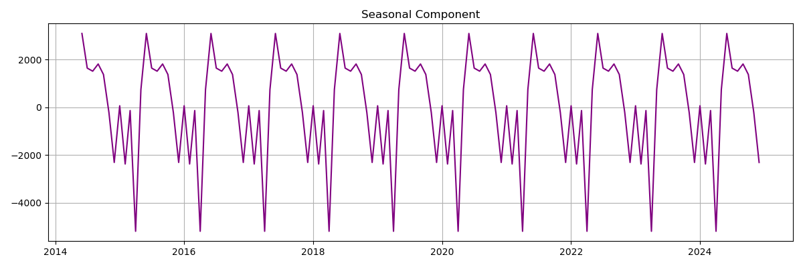

# Forecasting U.S. Retail Sales with ARIMA  
### A Financial KPI Forecasting Project  
**Author:** Damar Shipp Jr. | Data-Backed Financial Analyst | U.S. Army Veteran

---

## Project Overview

This project uses ARIMA time series modeling to forecast U.S. monthly retail sales based on historical data from the Federal Reserve (FRED). Retail sales are a key macroeconomic KPI used to understand consumer demand, guide corporate planning, and influence investment strategy.

My objective was to:
- Analyze and model retail sales data from 2014–2024 (Last Decade)
- Forecast the next 24 months of consumer activity
- Identify seasonal trends and macro patterns
- Communicate actionable insights for financial planning

---

## Business Problem

Forecasting retail sales is critical for:
- Inventory and supply chain planning
- Revenue modeling and budget forecasts
- Anticipating consumer demand shifts
- Supporting executive financial decisions

Traditional approaches rely on lagging reports. This model creates a forward-looking lens to support proactive financial strategy.

---

## Dataset

- **Source:** Federal Reserve Economic Data (FRED)
- **Series:** RSXFS – Retail & Food Services Sales (Seasonally Adjusted)
- **Frequency:** Monthly
- **Time Range:** January 2014 – December 2024
- **Units:** Millions USD

---

## Tools & Technologies

- **Languages:** Python
- **Libraries:** pandas, matplotlib, statsmodels, pmdarima, seaborn
- **Techniques:** ARIMA, ADF Test, Seasonal Decomposition, Confidence Intervals
- **IDE:** Jupyter Lab

---

## Methodology

1. **Data Loading:** Pulled RSXFS series from FRED using `pandas_datareader`  
2. **EDA:** Identified seasonality, trend, and outliers using decomposition and rolling averages  
3. **Stationarity Check:** Applied Augmented Dickey-Fuller (ADF) test and differencing  
4. **Modeling:** Tuned and trained ARIMA model using `auto_arima()`  
5. **Forecasting:** Generated 24-month forecast with 95% confidence intervals  
6. **Evaluation:** Analyzed residuals, AIC, and in-sample RMSE  
7. **Insights:** Converted forecasts into financial planning guidance

---

## Results

The final ARIMA model forecasted 24 months of retail sales, capturing Q4 seasonality and post-pandemic recovery trends. The confidence intervals remained tight, indicating model stability.

| Metric        | Value       |
|---------------|-------------|
| AIC           | ~2750       |
| In-sample RMSE| ~35190 |
| Model Used    | ARIMA(p,d,q) with auto-tuning |

---

## Visual Summary

---

## Key Takeaways

- Retail sales show a strong trend with consistent holiday season spikes  
- ARIMA offers interpretable and stable forward projections  
- Forecasts like this can guide revenue modeling, inventory buys, and economic scenarios  
- This project demonstrates my ability to build, tune, and explain predictive models with business relevance

---

## Next Steps

- Compare performance with SARIMA or Facebook Prophet  
- Integrate inflation, unemployment, and CPI as multivariate features  
- Deploy a live dashboard via Streamlit or Tableau  
- Explore rolling validation and real-time forecasting pipeline

---

## About the Me

**Damar Shipp Jr.**  
Orlando, FL  
Aspiring Financial Analyst | Data Scientist | U.S. Army Veteran  
(https://www.linkedin.com/in/damar-shipp-jr)  

---

> *“Data isn’t just numbers; it's a language, it’s guidance. My mission is to turn raw data into clear decisions.”*
